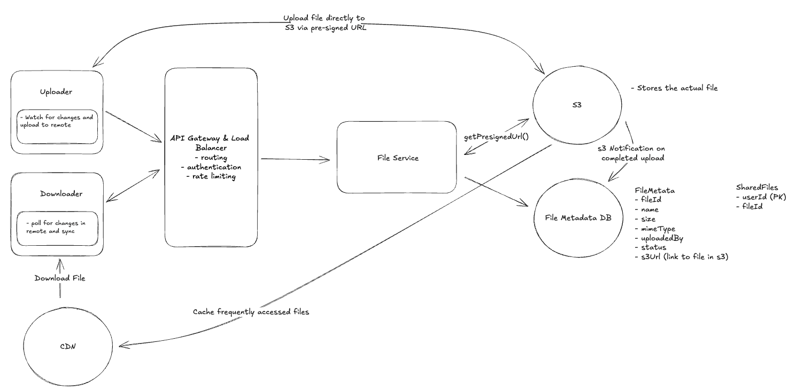

## Design Dropbox

### Functional Requirements
- User should be able to upload any file from any device
- User should be able to download any file from any device
- User should be able to share a file with other and see files shared by others with him
- files should be synced across devices
-  Users should be able to view files without previewing them (optional)

### Non-Functional Requirements
- System should be highly available(Availability > Consistency)
- It should support files as large as 50GB
- Upload, Download and Sync times should be low

### Database entity design

### API Designs
Primary Apis will be

- Upload a file
```
POST /files
Request:
{
  File, 
  FileMetadata
} 
```

- Download a file
```
GET /files/{fileId} -> File & FileMetadata
```

- Share a file
```
POST /files/{fileId}/share
Request:
{
  User[] // The users to share the file with
}
```

- Synching files
```
GET /files/changes?since={timestamp} -> ChangeEvent[]
```
A genera way of synching files can be to query file changes after a specific timestamp. The device on which we want to sync on can have a `last synched on` timestamp, and this can be used in our api to query changes that occured after it. The `ChangeEvent` object, will have `fileId(s)`, the type of change (created, updated, deleted) and the updated metadata

### High Level Design
- #### User should be able to upload any file from any device
We will need to identify where to store the file and where to store the metadata. Since, there is no much structure required here, we can use a NoSQL db like dynamoDB to store it. So a simple data can look like:

```
{
    "id": "123",
    "name": "file.txt",
    "size": 1000,
    "mimeType": "text/plain",
    "uploadedBy": "user1"
}
```
As for the methods to save a file we can

- (Bad Approach) : Directly upload the files to our file server : This approach is bad because as the number of files grow, we may need another big server to accomodate more files. Also, if the access to the server goes dowm, the access of the files also goes

- (Better Approach) : Upload the files onto a BLOB storage like Amazon S3 : A good approach is to send the file to be saved into the blob storage when the user uploads a file. This approach is quite redundant as we still need to upload the file onto the file server before we can send it to other service to be saved.

- (Optimal Approach) : Instead of uploading the file onto our server first, we can directly upload the file onto the BLOB storage through the client. This is done through presigned urls. So the process will be

    - The client will ask the file server for a presigned URL. The server will return the URL and save the metadata of the file with the status "Uploading"
    ```
        POST /files/presigned-url -> PresignedUrl
        Request:
        {
            FileMetadata
        }
    ```
    - The file can be uploaded to the storage via the presigned URL via put request
    - Once the file is uploaded, the blob storage will send a notification to the server. After that, we can change the status to "Uploaded"

- #### User should be able to download file from any device

    - (Bad Approach) Downloading through File Server : Again this approach becomes redundant as we first need to download from BLOB storage to our file sever, and then from our server to the client

    - (Better Approach) Downloading through a pre-signed URL : This approach is sub-optimal, as downloads for the users who are far away from our server can experience high download times

    - (Optimal Approach) Using a CDN to download the files: When a user requests a file, we can use a CDN to serve the file from the server closest to the user.For security, just like with our S3 presigned URLs, we can generate a URL that the user can use to download the file from the CDN. This URL will give the user permission to download the file from a specific location in the CDN for a limited time. 

- #### Users should be able to share a file with other users

    We can simply create a normalized table which will map userid to the fileid. So we can just have the userid indexed, and can just refer all of the files quickly shared with the user

    - #### Users can automatically sync files across devices
    There will be two directions where we need to sync the data
    - Local -> Remote
    - Remote -> Local

    `Local -> Remote`
    <br>
    When a user updates a file on their local machine, we need to sync these changes with the remote server. We consider the remote server to be the source of truth, so it's important that we get it consistent as soon as possible so that other local devices can know when there are changes they should pull in.

    To do this, we need a client-side sync agent that:
    1. Monitors the local Dropbox folder for changes using OS-specific file system events (like FileSystemWatcher on Windows or FSEvents on macOS)
    2. When it detects a change, it queues the modified file for upload locally
    3. It then uses our upload API to send the changes to the server along with updated metadata
    4. Conflicts are resolved using a "last write wins" strategy - meaning if two users edit the same file, the most recent edit will be the one that's saved

    `Remote -> Local`
    <br>
    For the other direction, each client needs to know when changes happen on the remote server so they can pull those changes down.
    There are two main approaches we could take:
    1. Polling: The client periodically asks the server "has anything changed since my last sync?" The server would query the DB to see if any files that this user is watching has a updatedAt timestamp that is newer than the last time they synced. This is simple but can be slow to detect changes and wastes bandwidth if nothing has changed.
    2. WebSocket or SSE: The server maintains an open connection with each client and pushes notifications when changes occur. This is more complex but provides real-time updates.

    For the other direction, each client needs to know when changes happen on the remote server so they can pull those changes down.
    There are two main approaches we could take:
    - Polling: The client periodically asks the server "has anything changed since my last sync?" The server would query the DB to see if any files that this user is watching has a updatedAt timestamp that is newer than the last time they synced. This is simple but can be slow to detect changes and wastes bandwidth if nothing has changed.
    - WebSocket or SSE: The server maintains an open connection with each client and pushes notifications when changes occur. This is more complex but provides real-time updates.

### Final System


- `Uploader`: This is the client that uploads the file. It could be a web browser, a mobile app, or a desktop app. It is also responsible for proactively identifying local changes and pushing the updates to remote storage.
- `Downloader`: This is the client that downloads the file. Of course, this can be the same client as the uploader, but it doesn't have to be. We separate them in our design for clarity. It is also responsible for determining when a file it has locally has changed on the remote server and downloading these changes.
- `LB & API Gateway`: This is the load balancer and API Gateway that sits in front of our application servers. It's responsible for routing requests to the appropriate server and handling things like SSL termination, rate limiting, and request validation.
- `File Service`: The file service is responsible for reading and writing file metadata in the database and generating presigned URLs using the S3 SDK. Generating a presigned URL is a purely local operation, meaning the service uses its AWS credentials to cryptographically sign a URL without making any call to S3. The file service doesn't handle file uploads or downloads directly; it's the control plane that coordinates between the client and S3.
- `File Metadata DB`: This is where we store metadata about the files. This includes things like the file name, size, MIME type, and the user who uploaded the file. We also store a shared files table here that maps files to users who have access to them. We use this table to enforce permissions when a user tries to download a file.
- `S3`: This is where the files are actually stored. We upload files directly to S3 using presigned URLs generated by the file service.
- `CDN`: This is a content delivery network (like CloudFront) that caches files close to the user to reduce latency. For downloads, instead of giving users a direct S3 presigned URL, the file service generates a CDN signed URL. The CDN fetches the file from S3 on the first request (cache miss) and serves it from the edge on subsequent requests (cache hit). This means users download from the nearest CDN edge location rather than from the S3 region directly.