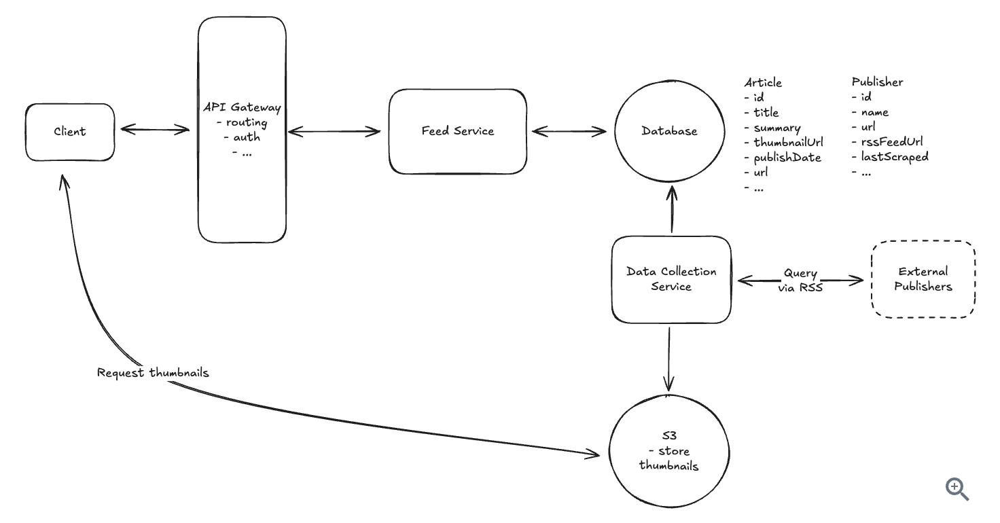

## News Aggregator

### Functional Requirements
- Users should be able to view an aggregated feed of news articles from thousands of source publishers from all over the world based on the region
- Users should be able to scroll through the feed infinitely
- Users should be able to click on articles and be redirected to the publishers website to read the full content
- Users should be able to customize their feed based on interests(optional)
- Users should be able to save articles for later reading(optional)
- Users should be able to share articles(optional)

### Non-Functional Requirements
- The system should prioritize availability over consistency
- The system should handle millions of daily requests
- The system should have low latency feed times


### API Design
```
// Get a page of articles for the user's feed
GET /feed?page={page}&limit={limit}&region={region} -> Article[]
```

### High Level Design

- #### Users should be able to view an aggregated feed of news articles from thousands of source publishers all over the world
    There are two challenges here: collecting content from publishers and serving it to users efficiently

    To collect data from publishers, we need a **Data Collection Service** that runs as a background
    process to continuosly gather content from thousands of news sources:

    - Data collection service queries the database for the list of publishers and their RSS feed URLs
    - The service then polls RSS publisher feeds periodically
    - Article metadata is stored in our database and the thumbnails are stored in Object storage


    Now to show user feed, we will require a **Feed Service**. We need separate service here because the nature of these service is very different. One is read-heavy and other is write-heavy and different operational needs, one is user-facing and other is a background processing service

    So when a user requests their news feed:
    1. Client sends a get request to the gateway
    2. API gateway routes the request to the feed service
    3. Feed service will query the database for recent articles in the users region, in the decending order of publish date
    4. Database returns the article data containing metadata and the media URLS
    5. Feed service formats this data and returns to the client via the Gateway

    

- #### Users should be able to scroll through the feed infinitely
     A simple solution is to use offset based pagination using page numbers and page sizes to fetch batches of articles. Assume client intially loaded the page by the get request `/feed?region=IND&limit=20&page=1`. The client maintains the current page number. When the user scrolls to the end content, another request `/feed?region=IND&limit=20&page=2` is automatically made. The client then calculates the offset `page-1 * limit` and returns the results. This approach has performance limitations though

     Limitation: The major challenge that comes with this approach is when news articles are being published every few minutes. So imagine if the user is at page 2, and some articles are fed into the system, there is high chance that the articles at page 2 can shift to page 3 and the user will see those articles again, resuling in bad user experience. This problem is also widely regarded as `pagination drift problem`

     Solution to this is cursor based pagination.
     
    Simplest approach to this problem is to have monotonically increasing article ids from the start. Now the article id becomes the cursor and the db query will just look like: 
    `WHERE article_id < cursor_id ORDER BY article_id DESC LIMIT 20`