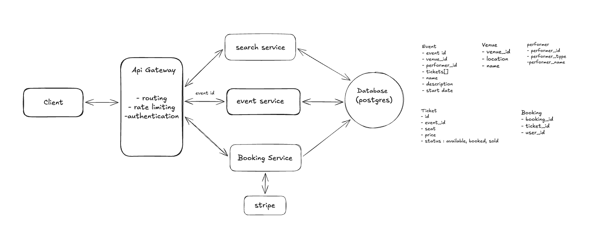
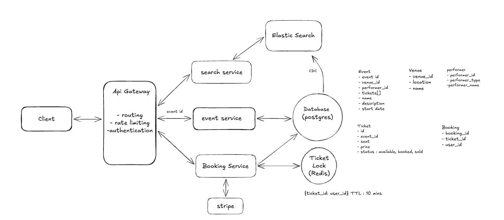

## Design Ticketmaster

### Functional requirements
1. Users should be able to view events
2. Users should be able to search for events
3. Users should be able to view tickets for events

### Non-Functional requirements
1. The system should prioritize availability for searching & viewing events, but should prioritize consistency for booking events (no double booking)
2. The system should be scalable and able to handle high throughput in the form of popular events (10 million users, one event)
3. The system should have low latency search (< 500ms)
4. The system is read heavy, and thus needs to be able to support high read throughput (100:1)

### Api Design
Api for viewing event details
```
GET /events/:eventId -> Event & Venue & Performer & Ticket[]
```

Api for event search
```
GET /events/search?keyword={keyword}&start={start_date}&end={end_date}&pageSize={page_size}&page={page_number} -> Event[]
```

Api for booking tickets
```
POST /bookings/:eventId -> bookingId
 {
   "ticketIds": string[], 
   "paymentDetails": ...
 }
```


### High Level Design



- #### Users should be able to view events
    We can have a simple `event service` which will return us the venue details, event details and the performer details. So the client will send a request `www.yourticketmaster.com/event/:eventId` which will be intercepted by the gateway and then transferred to our event service

- #### Users should be able to search for events
    The most basic thing we can do here is to have a simple `search service` which accepts search queries. So,
    1. The client makes a REST GET request with the search parameters
    2. The API gateway then, after handling basic authentication and rate limiting, forward the request onto our Search Service
    3. The Search Service then queries the Events DB for the events matching the search parameters and returns them to the client.

    This solution will be very slow as queries based on keywords will result in full table scans despite applying indexing. We can have an `elastic search` setup to fix it. To sync `Elasticsearch` with postgres, we can use CDC(change data capture) for near real time data synchronization

- #### Users should be able to book tickets to events
    The main challenge here is to prevent two users from booking the same tickets. If we just do a simple check to check if ticket is available and then update the ticket status and then insert a new row in booking table, this will create a bad user experience, as one user can go to payments page and after filling the form can find out ticket is no longer available.

    Thus to fix it we need to have some locking mechanism for the ticket row. Additionally, we also need to ensure that after a certain amount of time if user is not purchasing it, the lock gets released. And if the payment is done, we need to mark that ticket as successfull


    - (Bad Approach) : We can utilize database locking itself here which we can do with `SELECT FOR UPDATE` statement in postgresql. The main issue with this approach is in case of inactivity. If the user decides to abandon the payment process midway, the lock will be acquired till the time of session timeout. As it can only be released if transaction is committed or rolled-back.

    - (Great Approach) : We will use a Distributed Lock mechanism with a TTL(time to live) using Redis
        - When the user selects a ticket, acquire a lock in Redis using a unique identifier(ticket id) in this case and a TTL
        - If the user completes the purchase, the ticket's status is updated to Booked, and the lock in redis is manually released by the application code before TTL expiry
        - If TTL expires, Redis automatically releases the lock and the ticket is then available for purchase again

The final system after optimizations

