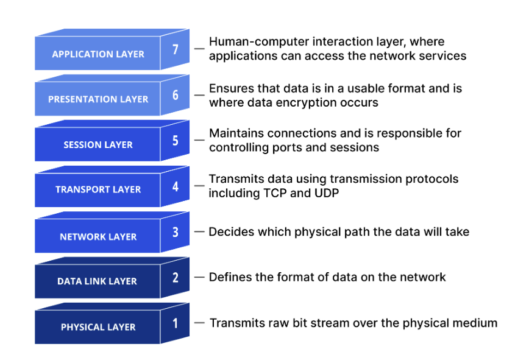

## OSI(Open Systems Interconnection) Model

This model is a set of rules that explains how different computer systems communicate over a network. This model contains 7 layers, with each layer having their own individual roles and responsibilities. 

   

- #### Application Layer 

  This is the only layer that directly interacts with data from the user. Software applications like web browsers and email clients rely on the application layer to initiate communications. But it should be made clear that client software applications are not part of the application layer; rather the application layer is responsible for the protocols and data manipulation that the software relies on to present meaningful data to the user. Application layer protocols include *HTTP * and *SMTP*
- #### Presentation Layer 

  This layer is primarily responsible for preparing data so that it can be used by the application layer; in other words, layer 6 makes the data presentable for applications to consume. This layer is responsible for translation, encryption and compression of data.

  Two communicating devices communicating may be using different encoding methods, so layer 6 is responsible for translating incoming data into a syntax that the application layer of the receiving device can understand. If the devices are communicating over an encrypted connection, layer 6 is responsible for adding the encryption on the sender’s end as well as decoding the encryption on the receiver's end so that it can present the application layer with unencrypted, readable data.

  Finally the presentation layer is also responsible for compressing data it receives from the application layer before delivering it to layer 5. This helps improve the speed and efficiency of communication by minimizing the amount of data that will be transferred.
- #### Session Layer

  This is the layer responsible for opening and closing communication between the two devices. The time between when the communication is opened and closed is known as the session. The session layer ensures that the session stays open long enough to transfer all the data being exchanged, and then promptly closes the session in order to avoid wasting resources.

  The session layer also synchronizes data transfer with checkpoints. For example, if a 100 megabyte file is being transferred, the session layer could set a checkpoint every 5 megabytes. In the case of a disconnect or a crash after 52 megabytes have been transferred, the session could be resumed from the last checkpoint, meaning only 50 more megabytes of data need to be transferred. Without the checkpoints, the entire transfer would have to begin again from scratch.
- #### Transport Layer

  Layer 4 is responsible for end-to-end communication between the two devices. This includes taking data from the session layer and breaking it up into chunks called segments before sending it to layer 3. The transport layer on the receiving device is responsible for reassembling the segments into data the session layer can consume.

  The transport layer is also responsible for flow control and error control. Flow control determines an optimal speed of transmission to ensure that a sender with a fast connection does not overwhelm a receiver with a slow connection. The transport layer performs error control on the receiving end by ensuring that the data received is complete, and requesting a retransmission if it isn’t. Transport layer protocols include `TCP` and `UDP`. 
- #### Network Layer

  The network layer is responsible for facilitating data transfer between two different networks. If the two devices communicating are on the same network, then the network layer is unnecessary. The network layer breaks up segments from the transport layer into smaller units, called packets, on the sender’s device, and reassembling these packets on the receiving device. The network layer also finds the best physical path for the data to reach its destination; this is known as routing.
- #### Data-Link Layer

  The data link layer is very similar to the network layer, except the data link layer facilitates data transfer between two devices on the same network. The data link layer takes packets from the network layer and breaks them into smaller pieces called frames. Like the network layer, the data link layer is also responsible for flow control and error control in intra-network communication (The transport layer only does flow control and error control for inter-network communications).
- #### Physical Layer

  This layer includes the physical equipment involved in the data transfer, such as the cables and switches. This is also the layer where the data gets converted into a bit stream, which is a string of 1s and 0s

---

## Communication Protocols

### HTTP(Hyper-text Transfer Protocol):

HTTP is a method for encoding and transporting data between a client and a server. It is a request/response protocol: clients issue requests and servers issue responses with relevant content and completion status info about the request. 

Key features of this protocol are:

- `Stateless` Each request is independent and the server doesn't retain previous interactions' information.
- `Text-Based` Messages are in plain text making them readable
- `Client-Server Model` Follows a client-server architecture for requesting and serving resources
- `Request-Response` Operates on a request-response cycle between clients and servers
- `Request Methods` Supports various methods like GET, POST, PUT, DELETE for different actions on resources

### Http verbs/methods

The following defines the different type of actions a client can perform on a resource hosted on a server

- `GET`: Retrieves data without modifying the resource
- `POST`: Used to create a new resource where the server assigns the new resource URI. For an example if we send a user body `{"name" : "john", "age" : 31}` to the end point /api/users, it will ultimately create a new resource which can be fetched later at /api/users/123. Thus all `POST` requests are *non-indempotent* . Sending the same POST request multiple times will create multiple resources. POST requests are also used for operations that don't fit nearly into CRUD(ex: triggering a process)
- `PUT`: It is used to completely replace a resource at a specific URL. We basically tell the server, here is the full complete representation of what should exist at this endpoint. Thus all PUT requests are *indempotent* . Sending the same PUT request multiple times will have the same effect as sending it once. A caution with this is, we must send all the fields even the unchanged ones. Any field omitted might result in the field not existing now.
- `PATCH` : It is used to partially modify a resource. Here we only send the fields we want to change
- `DELETE` : Removes a resource from the server
- `OPTIONS` :  Used to describe communication options for the target resource. Browser sends an OPTIONS request as a preflight request to find out the supported HTTP methods and other options supported for the target before sending the original request. 

### TCP(Transmission Control Protocol)

TCP (Transmission Control Protocol) is a protocol that allows devices to communicate reliably over a network. It ensures that data reaches the destination correctly and in the right order, even if parts of the network are slow or unreliable. It establishes a logical connection between the sender and receiver before data transmission begins. It ensures that data is delivered accurately and in the same order in which it was sent using acknowledgements and sequence numbers.

#### Connection Establishment and Termination

During `Connection Establishment`, the following series of segment exchanges occur between the client and the server

- The sender sends a `SYN (Synchronize)` segment to the reciever, signalling a request to open a connection
- The reciever sends back a `SYN-ACK (Synchronize - Acknowledge)` segment to the sender, acknowledging the request and agreeing to the connection
- The sender then sends `ACK (Acknowledge)` to the reciever and the connection is established

The following segment exchanges occur during `Connection Termination`

- The sender who wants to close the connection sends a `FIN (Finish)` segment to the **receiver.**
- The receiver acknowledges the FIN with an `ACK (Acknowledge)` .
- The receiver then sends its own FIN when it is ready to close the connection.
- The sender responds with an ACK, completing the termination.

#### How TCP works?

1. Segmenting

   - When an application sends data (like an email or file), TCP breaks the data into smaller chunks called segments.
   - Each segment has a header containing information like sequence numbers, ports, and flags.
   - This makes it easier to send large amounts of data over the network reliably.
1. Routing via IP

   - Once TCP creates segments, they are handed to IP (Internet Protocol).
   - IP is responsible for delivering the segments from the sender to the receiver, possibly through multiple routers
   - TCP doesn’t care about the path—IP handles routing and addressing
1. Reassembly at receiver

   - Segments may arrive out of order because they can take different paths through the network.
   - TCP at the receiver uses sequence numbers to reassemble the segments into the correct order to reconstruct the original message.
1. Acknowledgements

   - The receiver sends an ACK for every segment (or group of segments) it receives correctly.
   - This tells the sender that the data has arrived safely.
   - If an ACK is not received, TCP assumes the segment was lost and triggers retransmission.
1. Retransmission

   - If the sender does not receive an acknowledgment within a certain time, it resends the missing segment.
   - This ensures no data is lost, making TCP reliable.
1. Flow and Error Control

   - TCP prevents the sender from sending too much data too quickly for the receiver to handle, using a sliding window mechanism.

