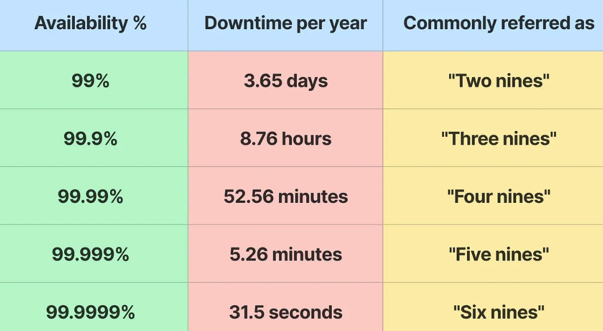
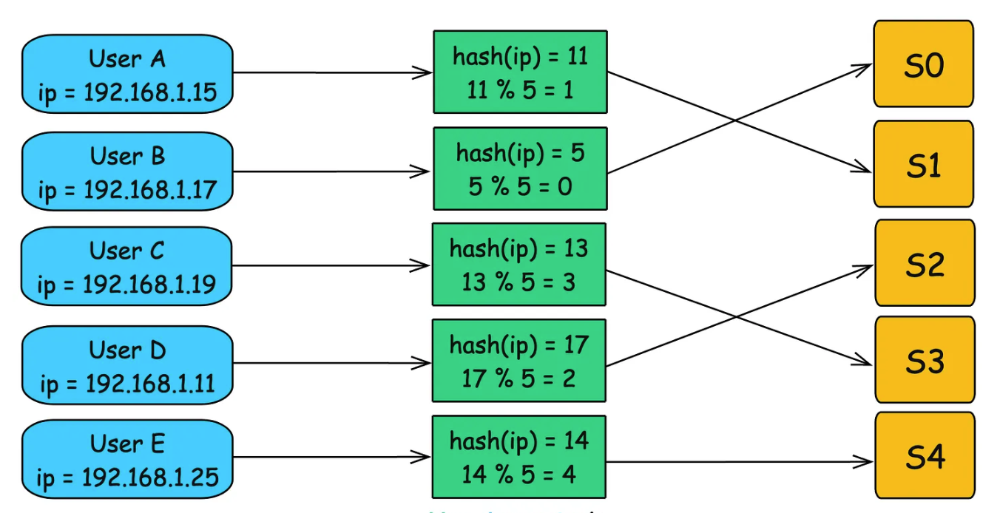
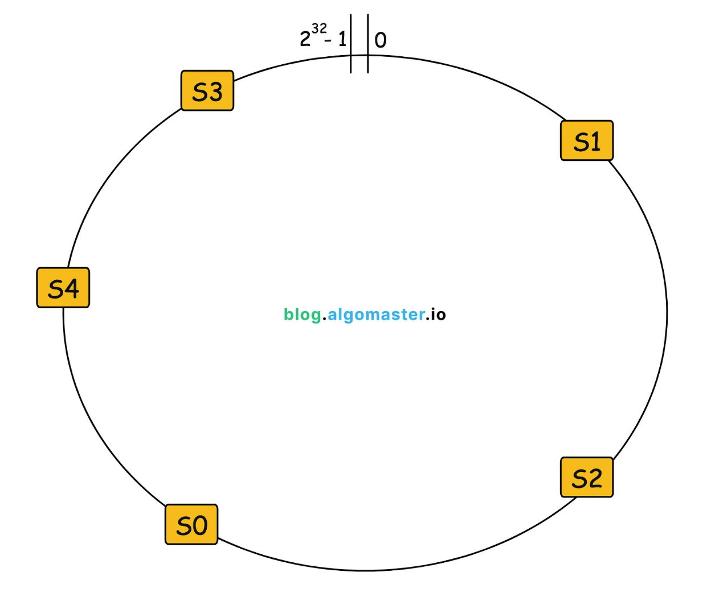

## **Scalability**

It is the capacity of a system to support growth or maintain performance when faced with an increased volume of work. It should be able to maintain improve its performance with the workload rises without creating the need for a re-architecture

How to achieve scalability?

- Vertical Scaling : Here we add more resources to the system like more RAM, better CPU etc
- Horizontal Scaling : We distribute the load, by employing more server or instances to the application and distributing the tasks among them
- Microservices: We break our application in multiple independent instances and we only scale those instances who are in need
- Serverless: Another approach is using services like AWS Lambda which handle all the scaling for us. It is usually great for unpredictable workloads

Below are the components that can be used to increase scalabilty:

1. Load Balancer: It distributes incoming load across servers to ensure no single resource is over-worked. There are several Load Balancing techniques that can be used to achieve it
1. Caching: It involved storing frequently accessed data in memory to reduce the time need to get the result by eliminating the need to access the original source of data.
1. [Database Replication](Database-Replication): It is the process of copying data from one database to another in real time
1. Database Sharding / Database Partitioning
1. CDNs(Content Delivery Networks): They can improve scalability by caching and delivering content from servers that are geographically closer to the users, reducing the latency and improving performance
1. Queuing Systems: They can improve scalability by decoupling components and allowing requests to be processed asynchronously

---

## **Availability**

A system's readiness and accessibility to users at any given point of time is referred to as its Availability.

Redundancy, fault tolerance and effective recovery techniques are usually used to achieve high scalability.

> Availability is expressed as the formula : Uptime / (Uptime + Downtime)

### Availability Tiers

Availability is often expressed in `nines`. Refer to the table below:

Each additional `nine` represents an order of magnitude improvement in availability. Example : 99.99% signifies a **10 times improvement** in uptime compared to 99.9%

Strategies to improve availability:

1. Redundancy: Use redundant servers or components so that in the event of a failure another instance can take over without any problems. Data centers, hardware redundancy are some examples
1. Load Balancing
1. Disaster Recovery: Having a comprehensive plan in place to recover the system in case of natural disasters
1. Scalability

---

## **Consistent hashing**

In a distributed system where nodes are frequently added or removed, a efficient routing solution becomes challenging. A common approach is to use **Hash-based Routing**, where we set a key we want to hash the request on (ex: ip address), and then mod it by the number of servers to get the desired server we want to route this request to.

For systems that use a stateless load balancing to route to the servers will be immune to this change. However,systems which are stateful in nature will face challenges.As the server mappings are cached on them, all of the hash keys that will be present at that time will have to be re-evaluated by the function to now accurately determine which server will this request now route to

Consider a system with 5 servers : S0, S1, S2, S3, S4 and the hash function takes the client's ip address to map to the server. So a basic routing flow will look like:

Now, if a server is added or removed, all the previous hashes that were saved now need to be re-evalauted which can cause potential down times, cache invalidations etc. This is where consistent hashing solves it.

  
<u>How consistent hashing works?</u>

It uses a **circular hash(hash ring)** with a large and constant space. The range is from `0 to 2^32 -1` (assuming a 32 bit hash function).  Behind the mechanism is just an array only, but this will mimic a circular structure as it rewinds to the start when the limit exceeds. Now, each server is assigned a position on the hash ring by computing the hash against the decided key (let us take **session_id** as the key in this case)

**Placing servers on the ring**

The 5 servers S0, S1, S2, S3, S4 using the hash function `Hash(session_id)` will be distributed across the ring in different positions like

In order to map keys to the corresponding server, the requests are also evaluated by the hash function by their key, **ip address** in this case. After placing them, we move clockwise around the ring to find the next available server. Then this key is assigned to the server

> In cases where the hash falls directly to the server, it will belong to that node

Now, assume that server S5 gets added which is placed between S1 and S2. Now only the requests whose hash was lying between S1 and S2 originally need to be re-evaluated. 